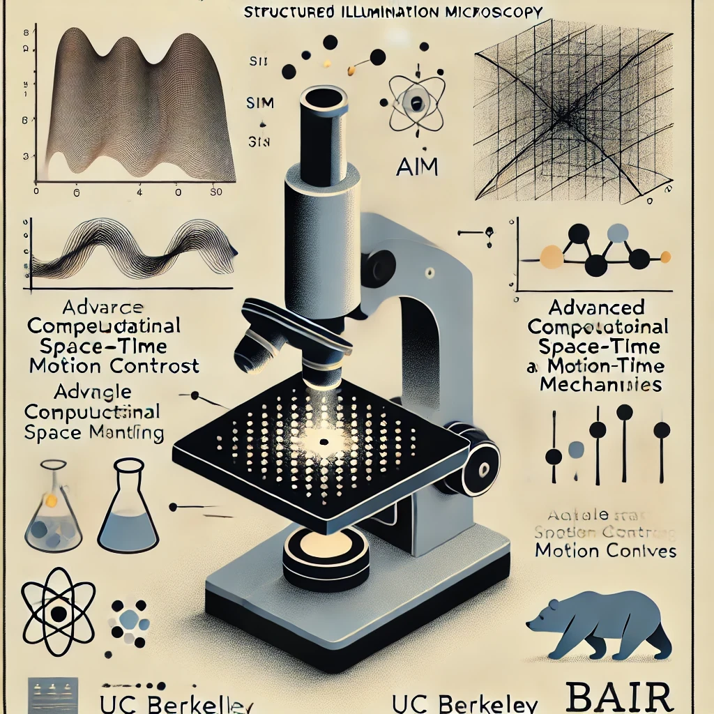

# Sample Motion for Structured Illumination Fluorescence Microscopy

<p align="center">

</p>

<p align="center">
    <a style="text-decoration:none !important;" href="https://arxiv.org/abs/2502.03667" alt="arXiv"> </a>
    <a style="text-decoration:none !important;" href="https://opensource.org/licenses/BSD-3-Clause" alt="License"></a>
</p>

Structured illumination microscopy (SIM) uses a set of images captured with different illumination patterns to computationally reconstruct resolution beyond the diffraction limit. Here, we propose an alternative approach **using a single speckle illumination pattern and relying on inherent sample motion to encode the super-resolved information in multiple raw images**. From a set of raw fluorescence images captured as the sample moves, we jointly estimate both the sample motion and the super-resolved image. We demonstrate the feasibility of the proposed method both in simulation and in experiment.


## Dependency

- [nstm](https://github.com/rmcao/nstm) ([installation guide](https://nstm.readthedocs.io/en/latest/installation.html))

## Run

Experimental data reconstruction: [Jupyter notebook](main.ipynb)

## Paper
```
@article{cao2025sample,
  title={Sample Motion for Structured Illumination Fluorescence Microscopy},
  author={Cao, Ruiming and Meng, Guanghan and Waller, Laura},
  journal={arXiv e-prints},
  pages={arXiv:2502.03667},
  year={2025},
  url={https://arxiv.org/abs/2502.03667}, 
}
```